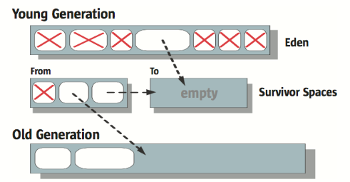

> 本文基于JDK7 HotSpot VM

### 判定对象无用的根据

​		通过可达性算法判断对象是否不再使用。即GC Roots，将GC Roots作为起始点向下搜索引用，还被GC Roots引用的对象就是可用的，而当一个对象没有到GC Roots有任何引用链的即为可回收的对象。

可作为GC Roots的对象：

- 当前各线程执行方法中的局部变量（包括形参）引用的对象
- 已被加载的类的 static 域引用的对象
- 方法区中常量引用的对象
- JNI （Native方法）引用的对象

### 内存的分配和回收

#### 对象内存布局

​		在堆为对象分配内存空间之前，应该先知道对象在内存中存储的布局；对象在内存中的存储布局主要分为：对象头，实例数据和对齐填充。

- 对象头：主要用于存储对象自身运行时的数据和类型指针
  - 运行时数据包括：哈希码（HashCode）、GC分代年龄、锁状态标志
  - 类型指针是指向类元数据的指针
- 实例数据：对象中的字段数据和父类继承过来的字段数据等
- 对齐填充：只是起到占位符的作用。因为HotSpotVM要求对象的起始地址必须是8字节的整数倍，当一个对象的实例数据（对象头是32bit或者64bit）不是8字节的整数倍时，就需要对齐填充来补全了

#### 对象内存分配

​        对象的内存分配主要在新生区的Eden空间上，当Eden区没有足够的连续空间时会触发一次MinorGC；但是一些需要连续大量内存空间的对象（很长的字符串或者数组）就会导致Eden区容纳不下这个对象（垃圾清理后仍然放不下），这个时候会直接在老年代中为其分配内存。

​		同时虚拟机也提供了 `-XX:PretenureSizeThreshold` 的参数，当对象的大小大于这个设置值的时候，会直接在老年代中进行内存分配，这样也可以避免新生代频繁的进行垃圾收集（新生代的垃圾收集是复制算法）

#### 内存分配方式

​        了解了对象内存分配的位置，那么就需要知道内存分配的方式了。

1. 有大片连续内存空间时（常用于**带压缩算法**的收集器，如Serial，ParNew）

​        当存在大片连续的内存可用于分配给新对象时，可以采用**指针碰撞**的方式（每次分配对象空间只要检测一下是否有足够的空间，如果有那么指针往前移动 N 位就分配好空间了，然后就可以初始化这个对象了）

​		对于多线程应用，对象分配必须要保证线程安全性，如果使用全局锁，那么分配空间将成为瓶颈并降低程序性能。HotSpot 使用了称之为**Thread-Local Allocation Buffers (TLABs) 的技术**，该技术能改善多线程空间分配的吞吐量。TLABs首先给予每个线程一部分内存作为缓存区，每个线程都在自己的缓存区中进行指针碰撞，这样就不用获取全局锁了。只有当一个线程使用完了它的 TLAB，它才需要使用同步锁定来获取一个新的缓冲区。

​		HotSpot 使用了多项技术来降低 TLAB 对于内存的浪费。比如，TLAB 的平均大小被限制在 Eden 区大小的 1% 之内。TLABs 和使用指针碰撞的线性分配结合，使得内存分配非常简单高效。

> 可用-XX:+UseTLAB 来启用TLAB技术

2. 内存空间碎片较多时（如CMS收集器，使用Mark-Sweep算法）

​        当已经使用的内存和空闲内存相互交错的时候，就不能直接的进行指针碰撞来分配内存了；这个时候虚拟机就会维护一个 **“空闲列表”** 来记录可用的内存块，在分配内存的时候会再列表中找到足够大的空间划分给对象，并且会更新列表上的记录

#### 内存分代思想

​		虚拟机采用了分代收集的思想去管理堆内存；分代思想指的是虚拟机根据对象的存活周期来划分内存，一般将堆内存划分为年轻代（新生代）和老年代；年轻代是在垃圾收集的时候会有大量的对象死去的内存区域，而老年代中的对象普遍是存活率高的

​		年轻代因为每次都有大量的对象死去，所以一般会采用复制算法（下文介绍，因为此算法只需要复制少量的存活对象，成本较低）；虚拟机在对象创建的时候会给对象定义一个对象年龄的计数器，对象在年轻代（Eden区）被创建并且经历过一次Minor GC（年轻代垃圾收集）并且存活，将会被移到Survivor区并且设置对象年龄为1，<u>该对象每熬过一次MinorGC，对象年龄就会加一</u>，当对象年龄达到一定程度就会晋升到老年代中（默认是15，可以通过 `-XX:MaxTenuringThreshold=15` 来设置）

​		但是如果每个对象都需要等到晋升年龄的话，Survivor区不一定能够容纳下这么多的对象。所以为了应对这种内存状况，虚拟机的解决办法是：如果Survivor区中**相同年龄的所有对象大小的总和**大于Survivor空间的一半，那么对象年龄大于或等于该值的对象就直接进入老年代，不需要达到晋升年龄

### 什么时候触发垃圾收集

1. 当年轻代被填满后（一般新对象在Eden区申请内存空间失败的时候），会进行一次年轻代垃圾收集（也叫做 Minor GC）

2. Full GC（通常也叫Major GC）会对整个堆进行垃圾收集，触发的情况：
   - 老年代或者永久代被填满的时候触发
   - 当新生代对象晋升到老年代担保失败的时候触发（即年轻代垃圾收集后会有一部分晋升到老年代的对象，当老年代不能容纳这些晋升的对象时会触发）
3. CMS垃圾收集器的触发时机；CMS垃圾收集器不会等到老年代或者永久代满了才开始进行垃圾收集（CMS只收集老年代old Gen），会有一个**预设占用率（initiating occupancy）**
   - 老年代的使用率达到阈值（通过JVM参数：**–XX:CMSInitiatingOccupancyFraction=n**设定，JDK8默认为92%）
   - 永久代的使用率到达阈值（**–XX:CMSInitiatingPermOccupancyFraction=n**设定，JDK8默认为92%）
   - 当新生代对象晋升到老年代担保失败的时候触发

注意： **只有CMS的concurrent collection是只收集old Gen的，其他的老年代垃圾收集器在满足条件后会触发Full GC，此时Full GC会收集整个GC堆，会先进行young GC（即使用年轻代的垃圾收集算法去收集年轻代的垃圾），然后使用老年代算法去收集老年代和方法区。**

​		**这里还有个值得注意的地方，当要进行一次young GC时，如果发现统计数据说之前young GC的平均晋升大小比目前old gen剩余的空间大，则不会进行young GC，而是会采用老年代的垃圾收集算法对整个堆进行垃圾收集（除了CMS）**

​		为什么说除了CMS呢，因为CMS垃圾收集器不能收集年轻代的垃圾。而且CMS有预设占用率会触发老年代的垃圾收集，所以CMS一般不会发生Full GC，但是当CMS发生 `concurrent mode failure` 的时候是会退化到发生Full GC，这个时候会变成使用备选的Serial Old收集器来对老年代进行垃圾收集（也有可能对整个堆进行垃圾收集哦，也就是发生上面一段话所说的情况）

#### 空间分配担保机制

​		分配担保机制指的是：在MinorGC后新生代还有大量的对象存活，并且Survivor区不能存放所有的存活对象的情况下，会将无法容纳的对象直接晋升到老年代中

​		分配担保机制触发是在<u>**老年代中的内存还有能容纳晋升上来的对象的空间**</u>，而且在最坏的情况下是整个Eden区的对象都是存活的，所以在发生MinorGC之前，虚拟机都会先检查老年代的最大可用的连续内存空间是否大于新生代所有对象的总和，如果条件成立，那么可以直接进行MinorGC。

否则会根据是否设置了担保失败机制来选择下一步

- 如果允许出现担保失败，则继续检查老年代中的最大可用连续内存空间是否大于之前每次垃圾回收晋升到老年代对象容量的平均值大小，如果大于则进行MinorGC，否则会进行Full GC来让老年代腾出更大的内存空间；比较平均值是一种动态手段，这种情况下如果出现上面最坏的情况，存活的对象远远高于平均值，是会出现担保失败的情况的（Handle Promotion Failure）；出现这种情况，会重新的进行一次Full GC去腾出更多空间。

  > -XX:+HandlePromotionFailure    允许担保失败
  >
  > -XX:-HandlePromotionFailure    不允许担保失败

- 如果不允许出现担保失败，则直接进行Full GC腾出空间。

注：推荐允许担保失败，因为这样能够避免频繁的Full GC	

### 垃圾收集算法

三种常用的垃圾收集算法的思想：

1. 标记清除算法

   - 首先标记出需要进行回收的对象，然后统一回收这些被标记的对象
   - 这个算法回收完对象之后会产生大量的不连续的内存空间，这些内存碎片容易导致在后续分配大对象的时候无法找到足够的连续的内存空间

2. 标记复制算法

   - 这里以年轻代为例子说明：将内存划分为一个**Eden区**和两个**Survivor区**，每次使用Eden区和其中一个Survivor区（为了内存利用率），当回收垃圾的时候，将Eden区和Survivor区存活的对象复制到另外一块Survivor区中，然后再将Eden区和用过的Survivor区的内存空间清理掉
   - 虚拟机会给对象定义一个对象年龄的计数器，当对象复制到Survivor区的时候，对象的年龄增加1，当达到一定程度的时候会晋升到老年代中
   - 当复制过去的对象在Survivor区中不够大小存放的时候（内存不足），此时会触发**分配担保机制**，直接将这些对象晋升到老年代中

   

   

3. 标记整理算法（标记 -> 清除 -> 压缩）

   - 这个算法跟标记清除算法差不多一样，只是当回收完被标记的对象后，会对内存空间进行压缩，将所有活的对象移到一边，然后会剩下一大片连续的内存空间，当产生新的对象时就很容易进行内存分配了

### 垃圾收集器

在了解垃圾收集器之前需要先认识几个概念

- **并行**：多个垃圾回收线程同时工作，此时用户线程处于等待状态。

- **并发**：垃圾回收线程和应用程序线程同时工作，应用程序不需要挂起。

- **Stop-the-world**：在垃圾收集时，需要将应用程序完全挂起的事件称为stop-the-world。

  > ​		这是因为GC需要在垃圾收集前分析堆中对象的引用关系并且保存准确性所导致的结果（如果不停顿应用线程的执行，那么会导致在分析过程中还会出现引用关系变化的情况，从而会让可达性算法分析的结果变得更加复杂和不准确）。
  >
  > ​		应用stop-the-world的垃圾收集器会简单很多，应为在应用程序停顿的时候，堆内存空间是不会发生变化了，此时就能够准确的标记无用的对象。但是在web应用环境下，它挂起应用线程的时间是不能被接受的。

- **吞吐量**：应用程序执行时间   / （应用程序执行时间 + 垃圾收集时间）

#### 串行垃圾收集器

​	年轻代和老年代都使用单线程的方式来进行垃圾收集（在多核CPU下也只会使用一个CPU进行垃圾收集），收集过程需要stop-the-world。

##### Serial收集器

​	用于年轻代的垃圾收集，主要采用了标记复制算法。

##### SerialOld收集器

​	用于老年代的垃圾收集，主要采用了标记整理算法（标记 -> 清除 -> 压缩算法）

##### 串行垃圾收集的优点

- 简单高效
- 对于单个CPU的环境下，串行收集器没有线程间交互的时间开销
- 适用于运行在client模式下的程序

可以使用`-XX:+UseSerialGC`来使用Serial + SerialOld的组合进行垃圾收集

#### 并行垃圾收集器

​		并行垃圾收集器利用多核的优势，垃圾收集的工作将分配给多个线程在不同的 CPU 上同时进行。并行的收集器仍然会stop-the-world，只不过使用多核的优势并行执行，降低停顿的时间；同时降低垃圾收集的时间，从而提高吞吐量。

​		并行垃圾收集器能够通过 `–XX:ParallelGCThreads=n`来控制垃圾收集线程的个数，**合理利用CPU的资源能够有效的降低垃圾收集的停顿时间**，但是上面说过了串行收集器在单CPU环境下是没有线程间交互的开销的，所以在单CPU的环境下，可能效率会比串行收集器更低。

##### ParNew收集器

​		多线程版本的Serial收集器，它能够配合CMS收集器一起工作（CMS是老年代的收集器；因为是Serial的多线程版本，所以Serial收集器也能和CMS收集器配合工作）。和Serial一样采用标记复制算法，不过是并行的复制算法，需要stop-the-world。

​		可以用`-XX:+UseConcMarkSweepGC`来使用CMS + ParNew组合的垃圾收集器（这里会有个情况，当CMS出现concurrent mode failure的时候会使用Serial Old收集器来手机老年代的对象）；还可以用`-XX:+UseParNewGC`来使用Serial Old + ParNew的组合进行内存回收。

##### Parallel Scavenge收集器

​		吞吐量收集器，可以这样形容这个收集器。显而易见，这是能够控制吞吐量的垃圾收集器，同样的也是采用复制算法（需要stop-the-world）。此收集器提供了两个参数来控制吞吐量（控制GC的停顿时间），分别是：`-XX:MaxGCPauseMillis`和`-XX:GCTimeRatio`（**MaxGCPauseMillis**优先度更高）

1. MaxGCPauseMillis是设置最大的垃圾收集停顿时间

   - 过分的降低停顿时间的话（设置停顿时间很短的情况下），是会降低整体的吞吐量的。因为设置了很低的停顿时间，可能会使得虚拟机对新生代的空间进行调整（调整Eden和Survivor区的比例），当Eden区的空间变小了，会导致更频繁的进行垃圾收集。垃圾收集的停顿时间确实会因为Eden区变小从而降低了，但是更频繁的垃圾收集也会导致整体吞吐量降低。

2. GCTimeRatio是用来设置吞吐量的。此参数的值是：垃圾收集时间与应用程序运行时间的比值；例如

   - `-XX:GCTimeRatio=99` (同时也是默认值)此时相当于 垃圾收集时间:程序运行时间=1:99，则吞吐量=1/(1+99)=1% 

     > 个人观点（勿喷）：周志明老师JVM书上的描述有点不对，书中描述GCTimeRatio设置的值是吞吐量的倒数，比如默认值99，如果是吞吐量的倒数的话，那么吞吐量就是1/99了，这样看来是不对的。所以我认为描述为吞吐量倒数应该是不正确的。应该是垃圾收集时间与应用程序运行时间的比值

3. 当我们能够通过设置上面两个参数来控制吞吐量，但是不知道什么样的情况下是最好的（即不知道该如何设置年轻代内存大小和各个区之间的比值等）；这种情况下可以使用 `-XX:+UseAdaptiveSizePolicy` 来动态的调整虚拟机相关细节参数来达到设置好的停顿时间或者吞吐量，这中调节方式被称为GC自适应调节策略（建议使用该收集器时开启这个参数）

可以使用`-XX:+UseParallelOldGC`来使用Parallel Scavenge + Parallel Old的组合回收内存

##### Parallel Old收集器

​		Parallel Old是Parallel Scavenge的老年代版本。采用的是并行标记整理算法

