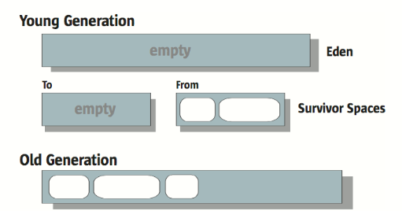

# 什么时候触发垃圾收集

1. 当年轻代被填满后（一般新对象在Eden区申请内存空间失败的时候），会进行一次年轻代垃圾收集（也叫做 Minor GC）

2. Full GC（通常也叫Major GC）会对整个堆进行垃圾收集，触发的情况：
   - 老年代或者永久代被填满的时候触发
   - 当新生代对象晋升到老年代担保失败的时候触发（即年轻代垃圾收集后会有一部分晋升到老年代的对象，当老年代不能容纳这些晋升的对象时会触发）
3. CMS垃圾收集器的触发时机；CMS垃圾收集器不会等到老年代或者永久代满了才开始进行垃圾收集（CMS只收集老年代old Gen），会有一个**预设占用率（initiating occupancy）**
   - 老年代的使用率达到阈值（通过JVM参数：**–XX:CMSInitiatingOccupancyFraction=n**设定，JDK8默认为92%）
   - 永久代的使用率到达阈值（**–XX:CMSInitiatingPermOccupancyFraction=n**设定，JDK8默认为92%）
   - 当新生代对象晋升到老年代担保失败的时候触发

注意： **只有CMS的concurrent collection是只收集old Gen的，其他的老年代垃圾收集器在满足条件后会触发Full GC，此时Full GC会收集整个GC堆，会先进行young GC（即使用年轻代的垃圾收集算法去收集年轻代的垃圾），然后使用老年代算法去收集老年代和方法区。**

​		**这里还有个值得注意的地方，当要进行一次young GC时，如果发现统计数据说之前young GC的平均晋升大小比目前old gen剩余的空间大，则不会进行young GC，而是会采用老年代的垃圾收集算法对整个堆进行垃圾收集（除了CMS）**

​		为什么说除了CMS呢，因为CMS垃圾收集器不能收集年轻代的垃圾。而且CMS有预设占用率会触发老年代的垃圾收集，所以CMS一般不会发生Full GC，但是当CMS发生 `concurrent mode failure` 的时候是会退化到发生Full GC，这个时候会变成使用备选的Serial Old收集器来对老年代进行垃圾收集（也有可能对整个堆进行垃圾收集哦，也就是发生上面一段话所说的情况）

# 垃圾收集算法

## 标记清除算法

​		首先标记出需要进行回收的对象，然后统一回收这些被标记的对象；速度较快，有较多的内存碎片

​		这个算法回收完对象之后会产生大量的不连续的内存空间，这些内存碎片容易导致在后续分配大对象的时候无法找到足够的连续的内存空间

## 标记复制算法

- 这里以年轻代为例子说明：将内存划分为一个**Eden区**和两个**Survivor区**，每次使用Eden区和其中一个Survivor区（为了内存利用率），当回收垃圾的时候，将Eden区和Survivor区存活的对象复制到另外一块Survivor区中，然后再将Eden区和用过的Survivor区的内存空间清理掉
- 虚拟机会给对象定义一个对象年龄的计数器，当对象复制到Survivor区的时候，对象的年龄增加1，当达到一定程度的时候会晋升到老年代中
- 当复制过去的对象在Survivor区中不够大小存放的时候（内存不足），此时会触发**分配担保机制**，直接将这些对象晋升到老年代中

## 标记整理算法

​		这个算法跟标记清除算法差不多一样，只是当回收完被标记的对象后，会对内存空间进行压缩，将所有活的对象移到一边，然后会剩下一大片连续的内存空间，当产生新的对象时就很容易进行内存分配了

​		因为清除之后，会进行压缩整理，这个阶段耗时较多，所以相较于标志清除算法会慢

# Stop-the-world

**Stop-the-world**：在垃圾收集时，需要**将应用程序（用户线程）完全挂起**的事件称为 stop-the-world

​		这是因为 GC 需要在垃圾收集前分析堆中对象的引用关系并且保存准确性所导致的结果；如果不停顿应用线程的执行，那么会导致在分析过程中还会出现引用关系变化的情况，从而会让可达性算法分析的结果变得更加复杂和不准确

​		`Minor GC` 都会引起 stop-the-world ，因为年轻代的垃圾回收涉及到对象的复制，复制的时候内存地址会发生改变，此时用户线程不挂起的话，就有可能访问不到这个对象了。而且年轻代会由多个用户线程进行对象创建使用，如果 `Minor GC` 的时候不挂起用户线程，那么也会导致可达性分析不准确且变得更加复杂

​		应用 stop-the-world 的垃圾收集器会简单很多，应为在应用程序停顿的时候，堆内存空间是不会发生变化了，此时就能够准确的标记无用的对象。但是在web应用环境下，它挂起应用线程的时间是不能被接受的

# 垃圾收集器

关于垃圾收集器的一些概念

- **并行**：多个垃圾回收线程同时工作，此时用户线程处于等待状态
- **并发**：垃圾回收线程和用户线程同时工作，应用程序不需要挂起

## 垃圾收集器的性能指标

- **吞吐量**：应用程序执行时间   / （应用程序执行时间 + 垃圾收集时间）
- **停顿时间**：垃圾收集过程中导致的应用程序挂起时间
- **频次**：相对于应用程序来说，垃圾收集的频次

## 串行垃圾收集器

​		年轻代和老年代都使用单线程的方式来进行垃圾收集（在多核CPU下也只会使用一个CPU进行垃圾收集），收集过程需要 stop-the-world

### Serial收集器

​	用于年轻代的垃圾收集，主要采用了标记复制算法。

### SerialOld收集器

​	用于老年代的垃圾收集，主要采用了标记整理算法（标记 -> 清除 -> 压缩算法）

### 串行垃圾收集的优点

- 简单高效
- 对于单个CPU的环境下，串行收集器没有线程间交互的时间开销
- 适用于运行在client模式下的程序

可以使用`-XX:+UseSerialGC` 来使用 Serial + SerialOld 的组合进行垃圾收集

## 并行垃圾收集器（吞吐量优先）

​		并行垃圾收集器利用多核的优势，垃圾收集的工作将分配给多个线程在不同的 CPU 上同时进行。并行的收集器仍然会 Stop-The-World，只不过使用多核的优势并行执行，降低停顿的时间；同时降低垃圾收集的时间，从而提高吞吐量

​		并行垃圾收集器能够通过 `–XX:ParallelGCThreads=n` 来控制垃圾收集线程的个数，**合理利用CPU的资源能够有效的降低垃圾收集的停顿时间**；因为当线程数过多的时候，会导致在垃圾回收时，多个线程把CPU的使用率占满即飙到 100%

串行收集器在单CPU环境下是没有线程间交互的开销的，所以在单CPU的环境下，可能效率会比串行收集器更低

### ParNew收集器

​		多线程版本的Serial收集器，它能够配合CMS收集器一起工作（CMS是老年代的收集器；因为是Serial的多线程版本，所以Serial收集器也能和CMS收集器配合工作）。和Serial一样采用标记复制算法，不过是并行的复制算法，需要stop-the-world

​		可以用 `-XX:+UseConcMarkSweepGC` 来使用 **CMS + ParNew** 组合的垃圾收集器（这里会有个情况，当CMS出现 concurrent mode failure 的时候会使用Serial Old收集器来手机老年代的对象）

​		可以用 `-XX:+UseParNewGC` 来使用 **Serial Old + ParNew** 的组合进行内存回收

### Parallel Scavenge收集器

​		吞吐量收集器，可以这样形容这个收集器。显而易见，这是能够控制吞吐量的垃圾收集器，同样的也是采用**复制算法**（需要 Stop-The-World）

​		此收集器提供了两个参数来控制吞吐量（控制GC的停顿时间），分别是：`-XX:MaxGCPauseMillis`和`-XX:GCTimeRatio`（**MaxGCPauseMillis**优先度更高）

1. MaxGCPauseMillis是设置**最大的垃圾收集停顿时间**
- 过分的降低停顿时间的话（设置停顿时间很短的情况下），是会降低整体的吞吐量的。因为设置了很低的停顿时间，可能会使得虚拟机对新生代的空间进行调整（调整Eden和Survivor区的比例），当Eden区的空间变小了，会导致更频繁的进行垃圾收集。垃圾收集的停顿时间确实会因为Eden区变小从而降低了，但是更频繁的垃圾收集也会导致整体吞吐量降低
2. GCTimeRatio是用来**设置吞吐量**的。此参数的值是：垃圾收集时间与应用程序运行时间的比值；例如
- `-XX:GCTimeRatio=99` （同时也是默认值）此时相当于 垃圾收集时间:程序运行时间=1:99，则吞吐量=1/(1+99)=1% （建议设置为：19）
3. 当我们能够通过设置上面两个参数来控制吞吐量，但是不知道什么样的情况下是最好的（即不知道该如何设置年轻代内存大小和各个区之间的比值等）；这种情况下可以使用 `-XX:+UseAdaptiveSizePolicy` 来**动态调整**虚拟机相关细节参数来**达到设置好的停顿时间或者吞吐量**，这中调节方式被称为G**C自适应调节策略**（建议使用该收集器时开启这个参数）

可以使用 `-XX:+UseParallelGC` 来使用 **Parallel Scavenge + Parallel Old** 的组合回收内存 

注：`-XX:+UseParallelOldGC` 和 `-XX:+UseParallelGC` 这两个命令都可以开启这个组合进行垃圾回收，只使用其中一个命令即可

### Parallel Old收集器

​		Parallel Old是Parallel Scavenge的老年代版本。采用的是并行标记整理算法

### 并行垃圾收集的优点

- 高吞吐量
- 能够合理有效的提高CPU的利用率

## CMS收集器（响应时间优先）

​		CMS （Concurrent Mark-Sweep）收集器，也叫做 **低延时收集器**。它是一种以获取最短回收停顿时间为目标的收集器

​		CMS 收集器是**唯一不进行压缩的收集器**，在它释放了垃圾对象占用的空间后，它不会移动存活对象到一边去。这将节省垃圾回收的时间，但是由于之后空闲空间不是连续的；所以CMS采用了 **空闲列表** 来进行内存的分配，显然这比使用简单的指针碰撞成本要高，同时也会加大年轻代垃圾收集的负载，因为年轻代中的对象如果要晋升到老年代中，需要老年代进行空间分配 

### 垃圾收集过程

1. **初始标记阶段（initial mark）**

   - 这个阶段会发生 Stop-the-world，停顿应用程序
   - 主要用于确定 GC Roots；速度很快

   

2. **并发标记阶段（concurrent mark）**

   - 这个阶段应用程序一起并发进行，主要是 GC Roots 的 Tracing 的过程（追溯）
   - 即标记 GC Roots 可达的所有存活对象

   

3. **再次标记阶段（remark）**

   - 由于并发标记阶段应用程序同时也在运行，并不能标记出所有的存活对象；所以就会在这个再次停顿应用程序
   - 这个阶段也会发生 Stop-the=world 
   - 这个阶段遍历在并发标记阶段应用程序修改的对象（标记出应用程序在这个期间的活对象）
   - 由于这次停顿比初始标记要长得多，**所以会使用多线程并行执行来增加效率**。（但是这个阶段远比并发标记阶段用时短）

   

4. **并发清理阶段（concurrent sweep）**

   - 在再次标记阶段结束后，能保证所有存活对象都被标记完成
   - 所以这个阶段就是并发的清理掉垃圾对象占用的空间

### CMS垃圾收集时机

​		CMS 收集器不会等到老年代满了才开始收集。否则的话，CMS 收集器将退化到使用更加耗时的 **stop-the-world、标记-清除-压缩** 算法

​		为了避免退化，CMS 收集器需要统计之前每次垃圾收集的时间和老年代空间被消耗的速度。另外，如果老年代空间被消耗了 **预设占用率（initiating occupancy）**，也将会触发一次垃圾收集

> 这个占用率通过 **`–XX:CMSInitiatingOccupancyFraction=n`** 进行设置，n 为老年代空间的占用百分比（JDK8及以后默认值是 **92**）

​		如果老年代空间不足以容纳从新生代垃圾回收晋升上来的对象，那么就会发生 **Concurrent Mode Failure**，此时会退化到发生 Full GC，清除老年代中的所有无效对象，这个过程是**单线程**的，比较耗时

​		即使在晋升的时候判断出老年代有足够的空间，但是由于老年代的碎片化问题，其实最终没法容纳晋升上来的对象，那么此时也会发生 Full GC，这次的耗时将更加严重，因为需要对整个堆进行压缩，压缩后年轻代彻底就空了

### CMS 的缺点

1. **CMS 收集器相比其他收集器需要使用更大的堆内存，且无法清理浮动垃圾**

   - 因为在并发标记阶段，程序还需要执行，所以需要留足够的空间给应用程序

   - 虽然收集器能保证在标记阶段识别出所有的存活对象，但是由于应用程序并发运行，所以刚刚标记的存活对象很可能立马成为垃圾，而且这部分由于已经被标记为 **存活对象**，所以只能到下次老年代收集才会被清理，这部分垃圾称为 **浮动垃圾**

     

2. **由于缺少压缩环节，堆将会出现碎片化问题**

   - 内存碎片过多时，将会给大对象的内存分配带来麻烦，往往会出现当堆内存空间还很大时，但是无法找到连续的内存空间来分配给这个对象，从而不得不触发一次 Full GC
   - CMS 收集器的 Full GC 会退化到使用更加耗时的 **stop-the-world、标记-清除-压缩** 算法 
- 为了解决这个问题，CMS 收集器需要追踪统计最常用的对象大小，评估将来的分配需求，可能还需要分割或合并空闲区域。内存的整理过程是无法并发的，此时能够解决碎片化问题，但是会导致 stop-the-world 的时间变长

### CMS小结

1. 和并行收集器相比，CMS 收集器 **降低了老年代收集时的停顿时间**（有时是显著降低），**稍微增加了一些年轻代收集的时间**、**降低了吞吐量** 以及 **需要更多的堆内存**
2. 显示指定：`-XX:+UseConcMarkSweepGC`  （年轻代使用的是 ParNew 收集器）
3. CMS 适用于应用程序要求低停顿，同时能接受在垃圾收集阶段和垃圾收集线程一起共享 CPU 资源的场景，典型的就是 web 应用
4. CMS收集器也能够通过 `–XX:ParallelGCThreads=n` 来控制垃圾收集线程的个数，n 默认和CPU的核数一致
5. 可以通过 `-XX:ConcGCThreads=threads` 设置并发的垃圾收集线程，一般建议设置成线程数的 1/4 （也就是 `ParallelGCThreads` 的四分之一）
6. `-XX:+CMSScavengeBeforeRemark` 这个命令就是在 再次标记阶段 之前对新生代进行一次垃圾回收（使用的是 ParNew 收集器）使用这个命令的原因是：
   - 有可能在重新标记的阶段时，新生代的对象中有对老年代中的对象的引用，那么就需要扫描所有新生代中对象对其进行可达性分析才能进行垃圾回收
   - 那么用了这个命令之后，在重新标记之前对新生代进行垃圾收集，此时新生代的对象很有可能就会减少很多，那么在重新标记阶段就会减少很多的可达性分析。节省时间和减轻扫描压力
7. `Concurrent Mode Failure`
   - 并发标记期间，如果在标记结束前，老年代被填满；就会直接触发 Full GC

## Garbage-First（G1收集器）

​		G1 的主要关注点在于达到 **可控的停顿时间**，在这个基础上尽可能提高吞吐量，这一点非常重要

​		G1 被设计用来长期取代 CMS 收集器，和 CMS 相同的地方在于，它们都属于并发收集器，在大部分的收集阶段都不需要挂起应用程序。区别在于，G1 没有 CMS 那么严重的碎片化问题，同时提供了更加可控的停顿时间

### G1内存划分

​		G1 将整个堆划分为一个个大小相等的小块（每一块称为一个 Region），每一块的内存是连续的。和分代算法一样，G1 中每个块也会充当 Eden、Survivor、Old 三种角色，但是它们不是固定的，这使得内存使用更加地灵活

​		**Remembered Sets**：每个区块都有一个 RSet，用于记录进入该区块的对象引用（如区块 A 中的对象引用了区块 B，**区块 B 的 Rset 需要记录这个信息**），它用于实现收集过程的并行化以及使得区块能进行独立收集。总体上 Remembered Sets 消耗的内存小于 5%

​		**Collection Sets**：将要被回收的区块集合。在 GC 时，在这些区块中的对象会<u>被复制到其他区块中</u>，总体上 Collection Sets 消耗的内存小于 1%

### G1年轻代收集（YoungGC）

- 年轻代是由多个不连续的区块组成，这样对于需要的一些情况下可以很方便进行缩容和扩容操作
- YoungGC 是 **并行** 且 **Stop-the-world** 的
- GC的时候会将存活的对象复制到 Survivor 区（包括 Survivor 复制到另外一个 Survivor，因为还没达到晋升年龄），或者会晋升到 Old Gen
- GC 后会基于**历史的 YoungGC 统计信息** 和 **用户定义的停顿时间** 目标 来调整Eden区和Survivor区的大小（年轻代会动态调整）

### G1老年代收集

#### 并发标记周期

1. **初始标记**
   - Stop-the-world，它伴随着一次普通的 Young GC 发生，然后对 Survivor 区（Root region）进行标记，因为该区可能存在对老年代的引用
   - 因为 Young GC 是需要 Stop-the-world 的，所以**并发周期直接重用这个阶段**，虽然会增加 CPU 开销，但是停顿时间只是增加了一小部分（所以初始标记阶段是在 YoungGC 期间进行的标记）
2. **扫描根引用区**
   - 因为先进行了一次 YGC，所以当前年轻代只有 Survivor 区有存活对象，它被称为根引用区。扫描 Survivor 到老年代的引用，该阶段必须在下一次 Young GC 发生前结束
   - 这个阶段不能发生年轻代收集，如果中途 Eden 区真的满了，也要等待这个阶段结束才能进行 Young GC
3. **并发标记**
   - **寻找整个堆的存活对象**，该阶段可以被 Young GC 中断（这个阶段是并发执行的，中间可以发生多次 Young GC，Young GC 会中断标记过程）
4. **重新标记**
   - Stop-the-world，完成最后的存活对象标记
   - 使用了比 CMS 收集器更加高效的 snapshot-at-the-beginning (SATB) 算法；这个阶段会回收完全空闲的区块
5. 清理

​		G1 的一个并发周期其实就是主要完成了**垃圾定位**的工作，定位出了哪些分区是垃圾最多的。因为整堆一般比较大，所以这个周期应该会比较长，中间可能会被多次 Stop-the-world 的 Young GC 打断

​		**并发标记周期** 虽然会释放一些内存，但是其不算是一次完整的GC。虽然并发标记结束后，G1 也就知道了哪些区块是最适合被回收的，那些完全空闲的区块会在这这个阶段被回收。如果这个阶段释放了足够的内存出来，其实也就可以认为结束了一次 GC

​		假设并发标记结束了一次GC，那么下次 GC 的时候，还是会先回收年轻代，如果从年轻代中得到了足够的内存，那么结束；过了几次后，年轻代垃圾收集不能满足需要了，那么就需要利用之前并发标记的结果，选择一些活跃度最低的老年代区块进行回收。直到最后，老年代会进入下一个并发周期

#### 混合垃圾回收周期

​		并发周期结束后是混合垃圾回收周期，不仅进行年轻代垃圾收集，而且回收之前标记出来的老年代的垃圾最多的部分区块

​		混合垃圾回收周期会持续进行，直到几乎所有的被标记出来的分区（垃圾占比大的分区）都得到回收，然后恢复到常规的年轻代垃圾收集，最终再次启动并发周期

​		混合垃圾回收周期的最终标记和拷贝存活对象的过程都会 Stop-the-world

### FullGC

G1中会导致 **Full GC** 的情况，也是需要极力避免的情况：

1. `Concurrent Mode Failure`

   - 并发模式失败：G1 并发标记期间，如果在标记结束前，老年代被填满，G1 会放弃标记

   > 发生了并发模式失败，那么说明
   >
   > - 堆内存需要增加了
   > - 或者需要调整并发周期，如增加并发标记的线程数量，让并发标记尽快结束
   > - 或者就是更早地进行并发周期，**默认是整堆内存的 45% 被占用就开始进行并发周期**

2. 晋升失败

   - 并发周期结束后，是混合垃圾回收周期，伴随着年轻代垃圾收集，进行清理老年代空间，如果这个时候清理的速度小于消耗的速度，导致老年代不够用，那么会发生晋升失败

3. 疏散失败

   - 年轻代垃圾收集的时候，如果 Survivor 和 Old 区没有足够的空间容纳所有的存活对象
   - 这种情况肯定是非常致命的，因为基本上已经没有多少空间可以用了，这个时候会触发 Full GC 也是很合理的（说明应该增加堆内存大小了）

4. 大对象分配失败

   - 因为堆中 Region 是不连续的，所以有时候找不到足够的连续空间来分配内存给大对象

### G1小结

1. JDK 9 默认使用的垃圾收集器，**G1就是用来替代CMS收集器**的

2. 在堆内存较小的情况下，G1和CMS的垃圾收集速度和暂停时间上的差距不太明显。但是随着堆内存越来越大，G1的优势会越来越明显

3. 指定期望的停顿时间 `-XX:MaxGCPauseMillis=200` （单位是ms），G1是可控停顿时间的垃圾收集器，G1 使用了 **停顿预测模型** 来满足用户指定的停顿时间目标，并基于目标来选择进行垃圾回收的区块数量。G1 采用增量回收的方式，每次回收一些区块，而不是整堆回收。它会尽力满足我们的停顿时间要求，但也不是绝对的，它基于之前垃圾收集的数据统计，估计出在用户指定的停顿时间内能收集多少个区块

4. 通过设置 `-XX:MaxGCPauseMillis=N` 来指定停顿时间（单位 ms，默认 200ms），如果没有达到这个目标，G1 会通过各种方式来补救：例如调整年轻代和老年代的比例，调整堆大小，调整晋升的年龄阈值，调整混合垃圾回收周期中处理的老年代的区块数量等等

   ​		调整每个参数满足了一个条件的同时往往也会引入另一个问题，比如为了降低停顿时间，可以减小年轻代的大小，可是这样的话就会增加年轻代垃圾收集的频率。如果减少混合垃圾回收周期处理的老年代区块数量，虽然可以更容易满足停顿时间要求，可是这样就会增加 Full GC 的风险等等

### G1常用参数

1. **`-XX:+UseG1GC`**
   - 使用 G1 收集器

2. **`-XX:MaxGCPauseMillis=200`**
   - 指定目标停顿时间，默认值 200 毫秒
   - 在设置 -XX:MaxGCPauseMillis 值的时候，不要指定为平均时间，而应该指定为满足 90% 的停顿在这个时间之内。停顿时间是我们设置的目标，但不是每次都一定能满足的

3. **`-XX:InitiatingHeapOccupancyPercent=45`**
   - 整堆使用达到这个比例后，触发并发 GC 周期，默认 45%
   - 如果要降低晋升失败的话，通常可以调整这个数值，使得并发周期提前进行
   - 这个参数在 JDK9 之后，用来设置初始值；后续会进行数据采样，然后进行动态的调整

4. **`-XX:NewRatio=n`**

   - 老年代 / 年轻代，默认值 2，即 1/3 的年轻代，2/3 的老年代
   - 不要设置年轻代为固定大小，否则：
     - G1 不再需要满足我们的停顿时间目标
     - 不能再按需扩容或缩容年轻代大小

5. **`-XX:SurvivorRatio=n`**

   - Eden / Survivor，默认值 8，这个和其他分代收集器是一样的

6. **`-XX:MaxTenuringThreshold =n`**

   - 从年轻代晋升到老年代的年龄阈值，也是和其他分代收集器一样的

7. **`-XX:ParallelGCThreads=n`**

   - 并行收集时候的垃圾收集线程数

8. **`-XX:ConcGCThreads=n`**

   - 并发标记阶段的垃圾收集线程数

   - 增加这个值可以让并发标记更快完成，如果没有指定这个值，JVM 会通过以下公式计算得到：

     `ConcGCThreads=( ParallelGCThreads + 2) / 4^3`

9. **`-XX:G1ReservePercent=n`**

   - 堆内存的预留空间百分比，默认 10，用于**降低晋升失败的风险**，即默认地会将 10% 的堆内存预留下来

10. **`-XX:G1HeapRegionSize=n`**

    - 每一个 region 的大小，默认值为根据堆大小计算出来，取值 1MB~32MB，这个我们通常指定整堆大小就好了

11. **`-XX:+UseStringDeduplication`**

    - 将所有新分配的字符串放入一个队列，当新生代回收时，G1并发检查是否有字符串重复，如果它们值一样，让它们引用同一个 `char[]`	
    - `String.intern()` 关注的是字符串对象，而字符串去重关注的是 `char[]`；在 JVM 内部，使用了不同的字符串表
    - 使用这个参数可以节省大量内存；但是会略微多占用了 cpu 时间，新生代回收时间略微增加

12. **`-XX:+ClassUnloadingWithConcurrentMark `**

    - 所有对象都经过并发标记后，就能知道哪些类不再被使用，当一个类加载器的所有类都不再使用，则卸

      载它所加载的所有类（默认开启）