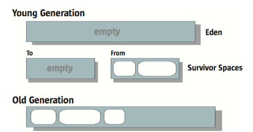

# 线程共享内存区域

## Java堆

​		此内存区域在虚拟机启动的时候创建，几乎所有对象的实例和数组都在堆中分配内存空间。	

​		Java堆是垃圾回收主要的管理区域，而且现在的垃圾收集器基本都采用分代收集算法（这是针对不同分代的特点采用适当的收集算法，提高垃圾收集的效率），所以一般为了在内存方面出发，堆可以分为老年代和新生代。

> ​		新生代中，也可以细分为Eden空间，To Survivor空间和From Survivor空间等。(垃圾收集和对象内存分配在垃圾收集再详细分析)
>
> - 这里分为这样的空间是因为采用了标记复制的垃圾收集算法，但是基本的标记复制算法是采用1:1的方式划分空间，这样的话会浪费掉很多内存空间的使用，所以分成了两个Survivor区和一个Eden区（默认1:1:8）
> - 当Eden区被占满或者Eden区没有办法为新对象分配足够的内存空间时，会触发垃圾回收；垃圾收集后存活的对象会被**复制**到From区，当From区满的时候会将存活的对象**复制**到To区域（此时包括来自Eden区存活的对象），然后这两个区域会交换角色。注意：Survivor区总是有一个是空的，Survivor-From 区的对象分两类，一类是年轻的对象（分代年龄小），也是复制到 Survivor-To 区，还有一类是老东西，晋升到老年代中。（参考下面两张图片，来源：《[Memory Management in the Java HotSpot Virtual Machine](http://www.oracle.com/technetwork/java/javase/memorymanagement-whitepaper-150215.pdf)》）
> - 上面说的会将存活对象复制到To区域说得不全面，因为有可能To区域的内存会被占满，然后还有其他存活的对象就没有办法放入到To区中，那么这里就涉及**分配担保机制**了，也就是Survivor区域的空间不够用的时候，这些存活对象会直接通过这个机制进入到老年代中
> - 虚拟机会给每个对象定义一个对象年龄的计数器，当年轻代的对象经过MinorGC开始复制到Survivor区的时候，对象的年龄会增加1，当对象年龄达到一定程度或者触发分配担保机制的时候会晋升到老年代当中

## 方法区

​		方法区主要用于存储被虚拟机加载的类信息（Class相关信息：类名，访问修饰符，字段描述，方法描述等），常量，静态变量，即时编译器编译后的代码等数据。

​		方法区通常被我们称作：永久代。但是这只是HotSpot VM对方法区的实现而已；在其他的VM（JRockit等）并没有永久代。

​	注意的是，在JDK1.8中，永久代已经被移除（JDK1.7中，永久代中的运行时常量池被移到堆中），此时HotSpot VM对方法区的实现变成了元空间`Metaspace` ，元空间和永久代的本质是类似的，不同的地方是元空间并不在虚拟机中，而是使用本地内存（Native Memory）。

> 在方法区中，对于很多动态生成类的情况容易出现OutOfMemoryError的异常。
>
> 常见的场景就是JSP页面较多的情况（JSP第一次运行需要进行编译）、CGLib增强和动态语言（*Groovy*）

### 运行时常量池

​		运行时常量池是属于方法区的一部分（JDK7后被移到堆中）。其用于存储**编译期**生成的字面量和符号引用。

> 程序运行期间可以通过`String.intern()` 将变量放入运行时常量池中

# 线程私有的内存区域

## 程序计数器

程序计数器是当前线程执行的代码的**行号指示器**

- 当执行Native方法的时候，该计数器值是空的(`undefined`)
- 该内存区域是唯一一个没有规定`OutOfMemoryError` 情况的区域

## Java虚拟机栈

​		Java虚拟机栈的生命周期与当前线程相同；虚拟机栈是Java方法执行时的内存模型，在方法执行时会创建栈帧存放局部变量表、操作数栈、动态链接和方法出口等信息。

​	在虚拟机栈中，我们平常主要关注的是局部变量表：

1. 局部变量表的内存空间在编译期间完成分配

2. 局部变量表包括基本数据类型、指向字节码指令的地址和对象的引用（即`reference`）

   - 对象的引用主要有句柄和直接指针的两种方式：

     - 句柄：使用句柄的方式时，JVM会在Java堆中开辟一部分内存作为句柄池，虚拟机栈中的`reference`中储存的就是句柄的内存地址，句柄则包含了该对象的实例数据和类型数据的内存地址。

       > 类型数据：该类型数据是在方法区中的Class类信息和静态变量等数据

     - 直接指针：顾名思义就是虚拟机栈中的`reference`中储存的是该对象的实例数据和类型数据的内存地址。

   - 两种方式各有各的优劣势：

     - 句柄：其优势之处就是稳定，当垃圾收集器回收内存中的对象时，该对象要么存活在年轻代要么晋升到老年代，这个时候该对象的内存地址就会发生改变，此时虚拟机栈中`reference` 的指针就不需要发生改变，只需要改变句柄中对象的内存地址即可。
     - 直接指针：直接指针访问对象的速度会比句柄快，因为它少了一次指针定位的开销。在大量的对象访问的时候，直接指针的效率是相当的客观。

------

> 线程请求的栈深度大于虚拟机所允许的最大深度，会抛出`StackOverflowError`异常
>
> > ​		这里的意思是：Java方法的从执行到结束就相当于将一个栈帧在虚拟机栈中的入栈和出栈的过程；当一个死循环的递归方法调用时，就会抛出StackOverflowError；因为死循环的递归，会不断的往虚拟机栈中压入栈帧，当达到最大深度时，则抛出该异常。
>
> 虚拟机在动态扩展时，无法为栈分配足够的内存空间时会抛出`OutOfMemoryError`异常
>
> > ​		这里有容易会和上面那个混淆，唯一需要分清的是当栈空间不够分配的时候：这种情况下是因为内存不足还是栈的深度不够的问题就能分清楚这两种情况了。

------

## 本地方法栈

​	本地方法栈跟Java虚拟机栈的作用基本上是相同的，不同之处是Java虚拟机栈服务的是Java方法，而本地方法栈服务的对象是Native方法