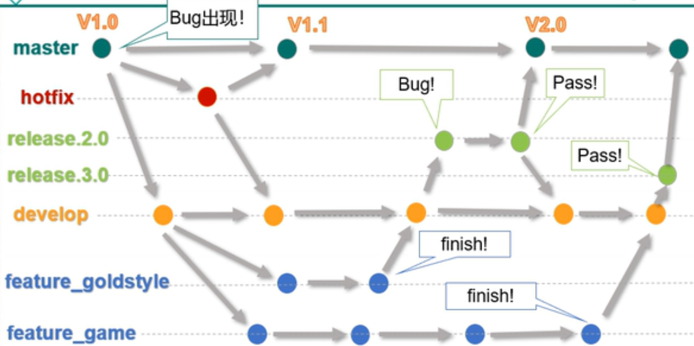

Git小结

## Git介绍

​		Git是分布式的VCS，简而言之，每一个你pull下来的Git仓库都是主仓库的一个分布式版本，仓库的内容完全一样

​		采用分布式模式的好处便是你不再依赖于网络，当有更改需要提交的时候而你又无法连接网络时，你只需要把更改提交到本地的Git仓库，最后有网络的时候再把本地仓库和远程的主仓库进行同步即可

### .git 文件夹

- **config文件**：该文件主要记录针对该项目的一些配置信息，例如通过git remote add命令增加的远程分支的信息就保存在这里
- **objects文件夹：**该文件夹主要包含git对象
- **HEAD文件：**该文件指明了git branch（即当前分支）的结果，比如当前分支是master，则该文件就会指向master，但是并不是存储一个master字符串，而是分支在refs中的表示，例如ref: refs/heads/master
- **index文件：**该文件保存了暂存区域的信息。该文件某种程度就是缓冲区（staging area），内容包括它指向的文件的时间戳、文件名、sha1值等
- **Refs文件夹**：该文件夹存储指向数据（分支）的提交对象的指针

## Git操作

### 分支操作

1. 创建分支：`git branch [分支名]`
2. 查看分支：`git branch -v [分支名]`
3. 切换分支：`git checkout [分支名]`
4. 创建+切换分支：`git checkout -b [分支名]`
5. 合并分支：（先切换回主干，然后再执行合并操作；即在哪个分支执行合并操作，就是将其他的分支合并到当前分支）
   - 合并分支需要先切换到主干：`git checkout [主干名]`
   - 然后执行合并操作：`git merge [需要合并的分支名]`
6. 删除分支：`git branch -D [分支名]`

### Git工作流

1. 首先是 master 主干，开发的时候应该创建一个 develop 开发分支
2. 如果需要开发新的功能模块，那么从 develop 分支创建新的分支去开发新的模块，例如 game/goldstyle 新分支去开发相应的新功能
3. 如果线上出现了 bug，那么应该创建一个 hotfix 分支去修复这个 bug，并且合并到master分支上；而且还需要将 hotfix 合并到 develop 分支上
4. 新功能开发完毕之后，应该先合并到 develop 分支上
5. 然后再创建一个 release 分支去进行测试，测试完成并且修复完bug后，就合并到 master 和 develop 分支上；合并到master分支后就可以上线了

> - 需要保证 develop 开发分支上的代码和master分支的代码是一致的，所以hotfix修复bug的分支也必须合并到develop分支上去
> - 开发新功能的时候，应该从develop分支创建一个新的分支去编写代码，这样能够并行的开发多个模块，互不影响

## Git和SVN的区别：

1. 集中式和分布式

​        Subversion属于集中式的版本控制系统；集中式的版本控制系统都有一个单一的集中管理的服务器，保存所有文件的修订版本，而协同工作的人们都通过客户端连到这台服务器，取出最新的文件或者提交更新

- 好处：每个人都可以一定程度上看到项目中的其他人正在做些什么。而管理员也可以轻松掌控每个开发者的权限。

- 缺点：中央服务器的**单点故障**。

---

​		Git属于分布式的版本控制系统；Git 更像是把变化的文件作快照后，记录在一个微型的文件系统中。每次提交更新时，它会纵览一遍所有文件的指纹信息并对文件作一快照，然后保存一个指向这次快照的索引。为提高性能，若文件没有变化，Git 不会再次保存，而只对上次保存的快照作一连接。

​		另外，因为Git在本地磁盘上就保存着所有有关当前项目的历史更新，并且Git中的绝大多数操作都只需要访问本地文件和资源，不用连网，所以处理起来速度飞快，等到了有网络的时候再将改动上传到远程的镜像仓库即可。

2. 版本库和工作区
   - SVN的版本库和工作区是分离的
   - Git 的版本库和工作区在同一个目录下，工作区的根目录有一个.git的子目录，这个名为 .git的目录就是版本库本身，它是Git 用来保存元数据和对象数据库的地方。